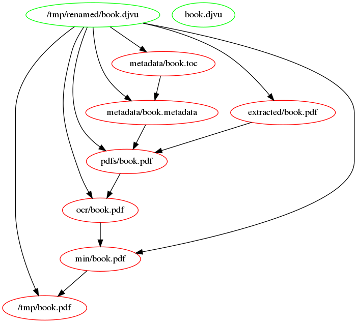

# Librarian

Дикая смесь разных утилит под упаковкой одного скрипта и все ради удобной конвертации книг в `.pdf`

## Граф конвертации
Экспериментально использовал `make` для декларативного описания графа конвертации

## TODO
- [ ] Почистить код
- [ ] Завернуть в пакет
- [ ] Добавить "супер" сжатие (например, через https://avepdf.com/en/hyper-compress-pdf)
